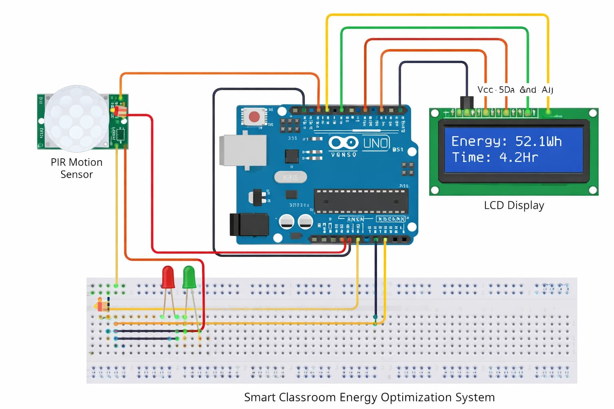

# ⚡ Energy Optimization System using Arduino

An intelligent energy-saving system built using **Arduino UNO, PIR Motion Sensor, and LCD Display** that automatically controls lighting based on human presence.

---

## 📌 Project Overview

Electricity wastage is a common issue in homes, classrooms, and offices when lights remain ON without human presence.

This project introduces an **automated energy optimization system** that detects human motion and controls lighting accordingly.

- Motion detected → Light ON
- No motion → Light OFF
- LCD displays system status and estimated energy saved.

---

## 🎯 Objectives

- Reduce electricity wastage
- Automate lighting systems
- Demonstrate practical IoT/embedded system concepts
- Promote energy-efficient solutions

---

## 🧰 Components Used

| Component | Quantity |
|-----------|----------|
| Arduino UNO | 1 |
| PIR Motion Sensor | 1 |
| LCD Display (16x2 with I2C) | 1 |
| LED | 1 |
| Resistor | 1 |
| Breadboard | 1 |
| Jumper Wires | Several |

---

## ⚙️ System Architecture

PIR Sensor detects motion → Arduino processes signal → LED/light control → LCD displays system status.

---

## ## 🔌 Circuit Diagram

---

## 🧠 Working Principle

1. The PIR sensor detects infrared radiation emitted by humans.
2. When motion is detected, the Arduino activates the light.
3. If no motion is detected for a certain period, the system turns the light OFF.
4. The LCD displays the system state and estimated energy savings.

---

## 📽️ Demo Video

🎥 Project demonstration video:

---

## 💻 Source Code

The Arduino source code is available in this repository.

Main file:

---

## 🚀 Future Improvements

- Integration with IoT platforms
- Mobile app control
- Real-time energy monitoring
- Smart home automation

---

## 📊 Applications

- Smart classrooms
- Office buildings
- Smart homes
- Energy-efficient lighting systems

---

## 🏆 Hackathon Submission

Submitted for:

**FOSSEE Open Source Hardware Hackathon 2026  
Indian Institute of Technology (IIT) Bombay**

---

## 👨‍💻 Authors

**Sujal Giri**

BTech Computer Science Engineering  
Shambhunath Institute of Engineering and Technology

Team Members:
- Hanshika Srivastava
- Aradhya Srivastava

---

## 📜 License

This project is open-source and available under the **MIT License**.

---

⭐ If you like this project, consider giving it a star on GitHub!
